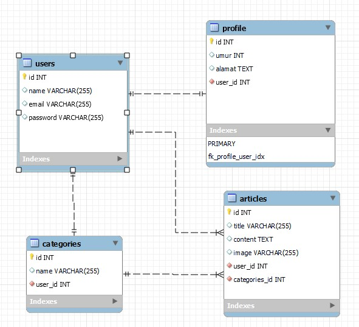

<h1>task-5-fullstack</h1>

<h2>Virtual Internship Experience (Investree) - Fullstack - Roosen Gabriel Manurung</h2>

<h2>Restful API menggunakan Laravel Passport </h2>
<ol>
    <li>jwt authentication menggunakan laravel passport</li>
    <li>restful api posts (create, list all, show detail, update & delete)</li>
    <li>mekanisme middleware auth api passport ke endpoint posts (create, list all, show detail, update dan delete)</li>
    <li>prefix versi pada api yang telah dibuat (contoh : api/v1)</li>
    <li>relasi eloquent pada table posts dan categories</li>
    <li>pagination pada api list all posts</li>
    <li>unit testing untuk setiap api posts</li>
</ol>

<h2>ERD</h2>

<h2>Tema Project: Blog Sederhana - Menggunakan laravel Blade serta Laravel UI</h2>

Pada project ini, saya menggunakan template [Purple Buzz – Free Responsive Bootstrap 5 HTML5] Link: https://themewagon.com/themes/free-bootstrap-5-html5-commercial-template-purple-buzz/

<ol>
  <li>Fitur authentication menggunakan laravel UI</li>
  <li>Fungsional CRUD article serta category </li>
  <li>Menggunakan laravel blade untuk membuat templatenya</li>
  <li>Relasi laravel eloquent untuk menghubungkan relasi antar tabel</li>
  <li> Seeder untuk membuat sample user</li>
  <li>Unit testing setiap halaman crud dan fitur </li>
</ol>
